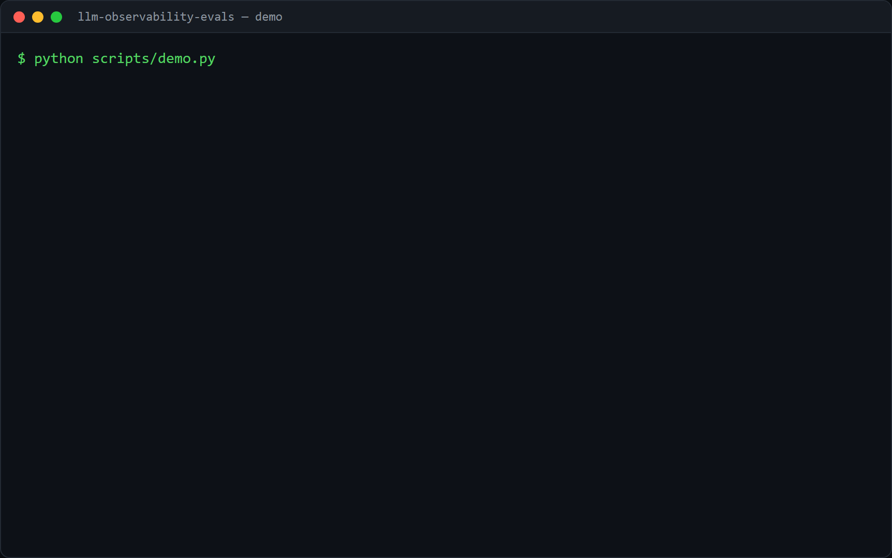

# llm-observability-evals

[](https://github.com/SamirDiegoChavezCaceres/llm-observability-evals/actions/workflows/ci.yml)  

Two things an LLM feature needs before it goes to production: you have to be able
to **see** what it did, and **measure** whether it was any good. This repo covers
both.

## Demo



The demo (`scripts/demo.py`) runs offline (a `RecordingTracer` instead of a real
Langfuse account, the heuristic judge, and a canned LLM judge) on a toy RAG about
the capital of France. It shows (1) a successful run traced as a nested span
tree, (2) a failing run marking the error on the span, (3) grading three answers
(correct, wrong, off-topic) with the offline heuristic judge, and (4) the same
scoring interface backed by an LLM judge, real if `OPENAI_API_KEY` is set,
otherwise a fake one so the path still runs.

Generate it with [VHS](https://github.com/charmbracelet/vhs): `vhs demo.tape`.

## 1. Tracing that never breaks the request

The pipeline is instrumented once against a tiny tracer interface, and the
backend is chosen at runtime:

- **No keys set? `NoOpTracer`.** Instrumentation must never be the reason a
  request fails, so without credentials it does nothing, with zero overhead.
- **`RecordingTracer`** captures the span tree in memory for tests and local
  inspection.
- **`LangfuseTracer`** sends traces to [Langfuse](https://langfuse.com); nesting
  is automatic, and a misbehaving SDK call degrades to a no-op for that node
  instead of taking down the pipeline.

```python
from llm_obs import rag_pipeline, RecordingTracer

tracer = RecordingTracer()
rag_pipeline("What is the capital of France?", retrieve, generate, tracer)
# tracer.roots -> rag-pipeline
#                   ├─ [retriever]  output={'num_docs': 2}
#                   └─ [generation] output={'output': 'The capital of France is Paris.'}
```

Turn on real tracing by installing the extra and setting the env:

```bash
pip install -e ".[langfuse]"
export LANGFUSE_PUBLIC_KEY=... LANGFUSE_SECRET_KEY=...
```

## 2. LLM-as-judge evaluation

Score outputs against a rubric. Two judges, one interface:

- **`HeuristicJudge`** - deterministic, offline. Groundedness = share of the
  answer's content words found in the retrieved context; relevance = share of
  the question's words the answer addresses. A cheap regression gate that needs
  no model.
- **`LLMJudge`** - sends a rubric to any `complete(prompt) -> str` model and
  parses per-criterion scores back (and fails safe on non-JSON output). The
  model is injected, so it is provider-agnostic and testable with a fake.

```python
from llm_obs import EvalSample, HeuristicJudge, evaluate_dataset

samples = [EvalSample(question, answer, context), ...]
summary = evaluate_dataset(samples, HeuristicJudge())
# {'groundedness': CriterionSummary(mean=0.5, pass_rate=0.5, n=2), ...}
```

To grade with a real model instead of the heuristic:

```bash
pip install -e ".[openai]"
cp .env.example .env               # then put your OPENAI_API_KEY in .env
```

```python
from llm_obs import LLMJudge, openai_complete, evaluate_dataset
summary = evaluate_dataset(samples, LLMJudge(complete=openai_complete()))
```

### Sending real traces to Langfuse

The `NoOpTracer` and `RecordingTracer` are real in-memory backends, not a mock of
Langfuse. To send traces to Langfuse itself, set credentials and the tracer
switches automatically:

- Easiest, no infra: a free [Langfuse Cloud](https://cloud.langfuse.com) project
  gives you the two keys.
- Self-hosted: run Langfuse's official docker-compose (see their repo).

```bash
pip install -e ".[langfuse]"
cp .env.example .env    # set LANGFUSE_PUBLIC_KEY / LANGFUSE_SECRET_KEY (+ HOST if self-hosting)
```

With the keys set, `get_tracer()` returns the `LangfuseTracer`; without them it
stays a no-op, so nothing else in the code changes.

## Try it

```bash
python scripts/demo.py     # prints the span tree and an eval summary
```

## Tests

```bash
pip install -e ".[dev]"
pytest
```

Covers nested-span recording, the no-op default, the heuristic judge on grounded
vs hallucinated answers, dataset aggregation, and the LLM judge's JSON parsing
(including the non-JSON fallback).

## Limitations and next steps

- The heuristic judge measures word overlap, not meaning; use the LLM judge for
  anything nuanced.
- The Langfuse path is best-effort and only lightly exercised without a live
  instance to send traces to.
- Next: add a small human-labeled set to check the judge against, and track eval
  scores across versions.

## License

MIT.
